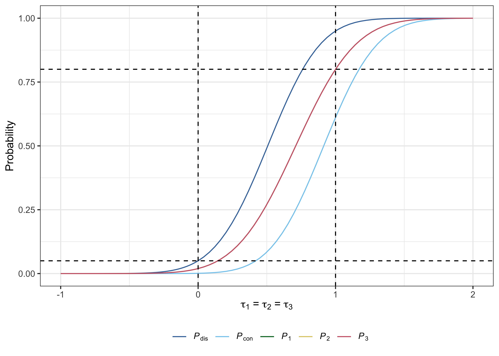
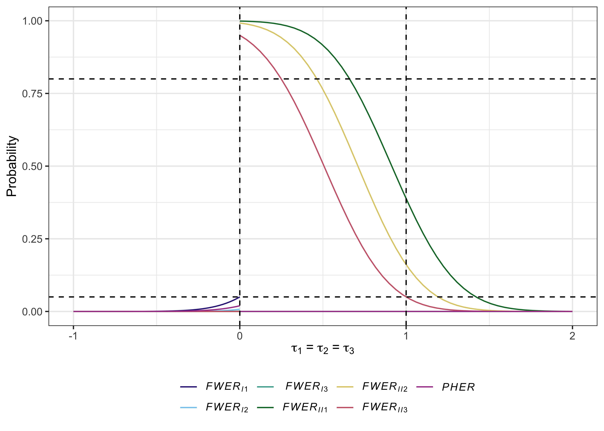
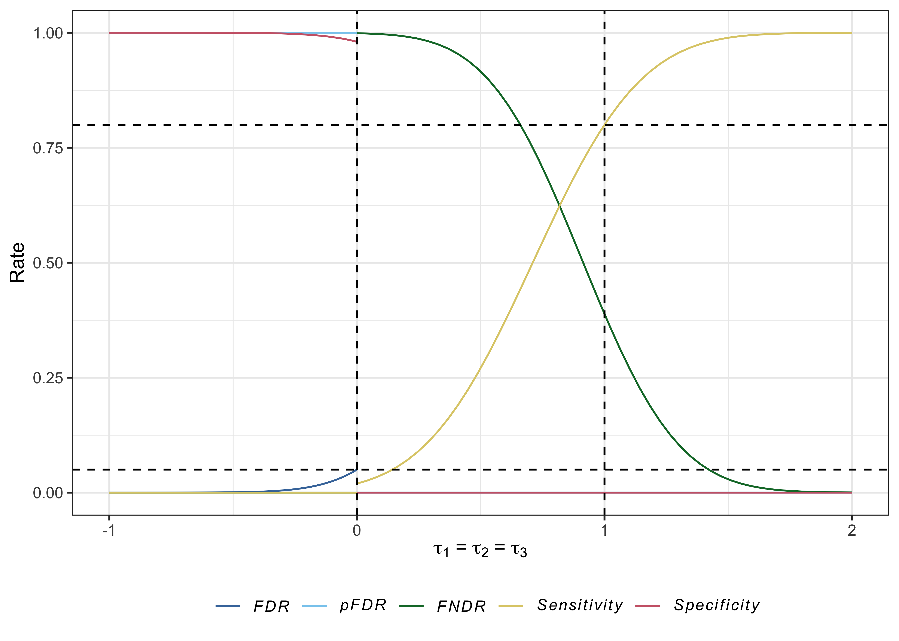
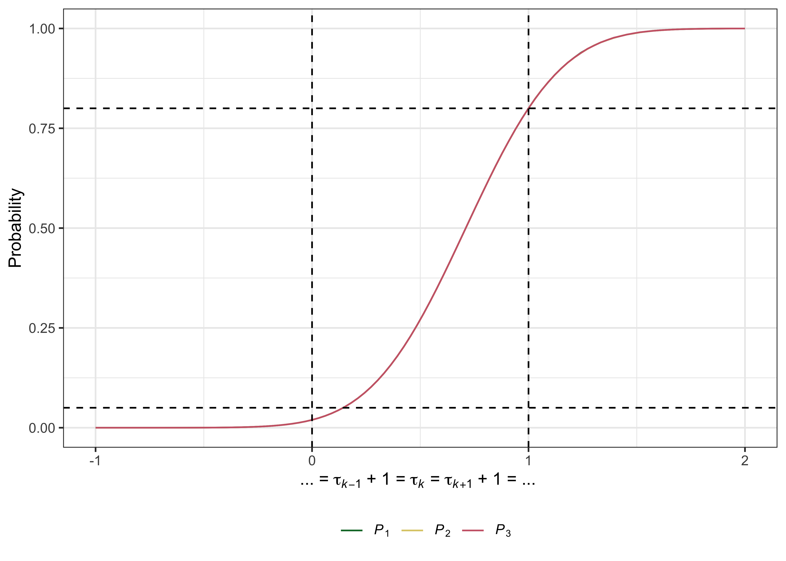

<!-- README.md is generated from README.Rmd. Please edit that file -->

# multiarm 

[](https://github.com/mjg211/multiarm)
[](https://github.com/mjg211/multiarm)
[](https://www.tidyverse.org/lifecycle/#maturing)


## Description

`multiarm` provides functions to assist with the design of single- and
multi-stage multi-arm clinical trials. In either case the available
functions allow for sample size determination, trial simulation,
analytical operating characteristic calculation, and the production of
several informative plots. An R Shiny graphical user interface is also
provided to aid design determination. Further details on single-stage
design can be found in [Grayling and Wason
(2020)](https://doi.org/10.1186/s12885-020-6525-0).

## Getting started

You can install the latest development version of `multiarm` from
[Github](https://github.com/) with:

``` r
devtools::install_github("mjg211/multiarm")
```

An introductory example of how to make use of some of the package’s core
functionality can be found below. More detailed support is available in
the package vignette, which can be accessed with `vignette("multiarm")`.
For further help, please email <michael.grayling@newcastle.ac.uk>.

## Details

In total, 31 functions are currently available. Their naming conventions
are such that several character strings are joined together, separated
by underscores. The first string indicates the purpose of the function
(i.e., what type of calculation it performs):

  - `build_###_###()`: Build multi-arm clinical trial design objects,
    like those returned by the `des_###_###()` functions. For use when a
    specific design is of interest.
  - \`des\_\#\#\#\_\#\#\#()\`\`: Determine the sample size required by a
    particular type of multi-arm clinical trial design.
  - `gui()`: Provides a graphical user interface to design
    determination.
  - `opchar_###_###()`: Determine the operating characteristics (power,
    family-wise error-rates, etc.) of a supplied multi-arm clinical
    trial design, via multivariate normal integration.
  - `plot.multiarm_des_###_###()`: Produce informative plots (power,
    false discovery rate curves, etc.) relating to a supplied multi-arm
    clinical trial design.
  - `sim_###_###()`: Empirically estimate the operating characteristics
    (power, family-wise error-rates, etc.) of a supplied multi-arm
    clinical trial design, via simulation.

The second indicates the design:

  - `###_dtl_###()`: Relate to multi-stage drop-the-losers designs. See,
    e.g., [Wason *et al*
    (2017)](https://doi.org/10.1177/0962280214550759).
  - `###_gs_###()`: Relate to group-sequential multi-arm multi-stage
    designs. See, e.g., [Magirr *et al*
    (2012)](https://doi.org/10.1093/biomet/ass002).
  - `###_ss_###()`: Relate to single-stage designs. See, e.g., [Grayling
    and Wason (2020)](https://doi.org/10.1186/s12885-020-6525-0).

The third indicates what type of outcome the function is for:

  - `###_###_bern()`: Assume a Bernoulli distributed primary outcome.
  - `###_###_norm()`: Assume a normally distributed primary outcome.

## Example: Single-stage design for a normally distributed outcome

Typically, a `des_###_###()` function would be used first to identify a
design for the trial parameters of interest. For example, consider
designing a single-stage trial for:

  - Three experimental treatment arms (see `K`).
  - Desiring a family-wise error-rate of at most 5%, controlling using
    Dunnett’s correction (see `alpha` and `correction`).
  - Desiring marginal power to reject each null hypothesis of 80% for a
    clinically relevant difference of 1 (see `beta`, `delta1`, and
    `power`).
  - Assuming the standard deviation of all responses is 1 (see `sigma`).
  - Allocating patients equally to each arm (see `ratio`).

To compute the design, we would run:

``` r
des <- des_ss_norm(K          = 3,
                   alpha      = 0.05,
                   beta       = 0.2,
                   delta1     = 1,
                   sigma      = rep(1, 4),
                   ratio      = rep(1, 3),
                   correction = "dunnett",
                   power      = "marginal")
```

Then, the total required sample size is:

``` r
des$N
#> [1] 67.46512
```

In addition, the operating characteristics under the *global null*,
*global alternative*, and each of the *least favourable configurations*,
can be accessed with:

``` r
des$opchar
#> # A tibble: 5 x 20
#>    tau1  tau2  tau3   Pdis    Pcon     P1     P2     P3 FWERI1  FWERI2  FWERI3
#>   <dbl> <dbl> <dbl>  <dbl>   <dbl>  <dbl>  <dbl>  <dbl>  <dbl>   <dbl>   <dbl>
#> 1     0     0     0 0.0500 0.00108 0.0196 0.0196 0.0196 0.0500 0.00771 0.00108
#> 2     1     1     1 0.950  0.611   0.800  0.800  0.800  0      0       0      
#> 3     1     0     0 0.800  0.00329 0.800  0.0196 0.0196 0.0359 0.00329 0      
#> 4     0     1     0 0.800  0.00328 0.0196 0.800  0.0196 0.0359 0.00329 0      
#> 5     0     0     1 0.801  0.00329 0.0196 0.0196 0.800  0.0359 0.00329 0      
#> # … with 9 more variables: FWERII1 <dbl>, FWERII2 <dbl>, FWERII3 <dbl>,
#> #   PHER <dbl>, FDR <dbl>, pFDR <dbl>, FNDR <dbl>, Sens <dbl>, Spec <dbl>
```

Useful plots can also be produced with `plot.multiarm_des_ss_norm()` as
follows:

``` r
plot(des)
```



    #> Warning: The `x` argument of `as_tibble.matrix()` must have unique column names if `.name_repair` is omitted as of tibble 2.0.0.
    #> Using compatibility `.name_repair`.
    #> This warning is displayed once every 8 hours.
    #> Call `lifecycle::last_warnings()` to see where this warning was generated.



## References

Grayling MJ, Wason JMS (2020) A web application for the design of
multi-arm clinical trials. *BMC Cancer* 20:80. DOI:
[10.1186/s12885-020-6525-0](https://doi.org/10.1186/s12885-020-6525-0).
PMID: [32005187](https://www.ncbi.nlm.nih.gov/pubmed/32005187).

Magirr D, Jaki T, Whitehead J (2012) A generalized Dunnett test for
multi-arm multi-stage clinical studies with treatment selection.
*Biometrika* 99(2):494–501. DOI:
[10.1093/biomet/ass002](https://doi.org/10.1093/biomet/ass002).

Wason J, Stallard N, Bowden J, Jennison C (2017) A multi-stage
drop-the-losers design for multi-arm clinical trials. *Stat Meth Med
Res* 26(1):508–524. DOI:
[10.1177/0962280214550759](https://doi.org/10.1177/0962280214550759).
PMID: [25228636](https://www.ncbi.nlm.nih.gov/pubmed/25228636).
