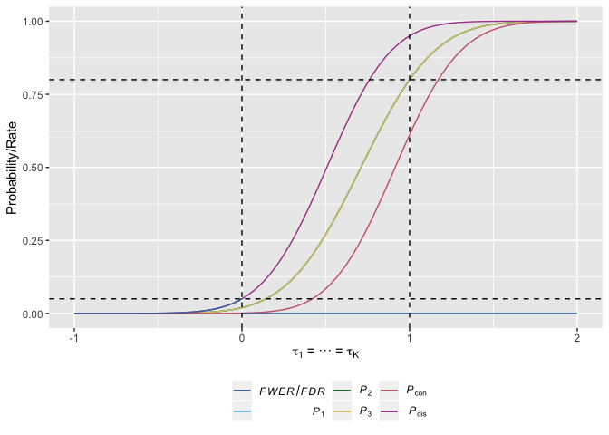
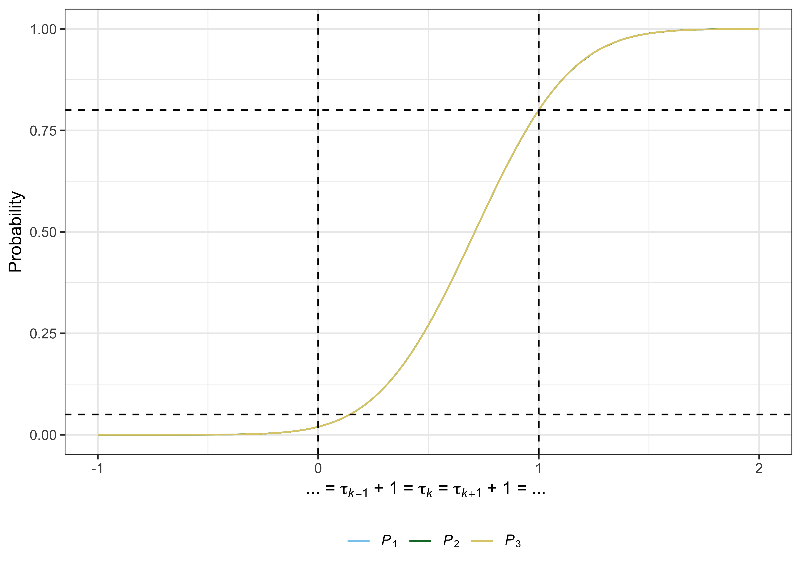

<!-- README.md is generated from README.Rmd. Please edit that file -->

# multiarm

[](https://github.com/dwyl/esta/issues)
[](https://www.tidyverse.org/lifecycle/#maturing)
[](https://github.com/mjg211/multiarm)
[](https://github.com/mjg211/multiarm/commits/master)

## Description

`multiarm` provides functionality to assist with the design and analysis
of fixed-sample multi-arm clinical trials utilising one of several
supported multiple comparison corrections. Available functions allow for
sample size determination (including for *A*-, *D*-, and *E*-optimal
designs), trial simulation, analytical operating characteristic
calculation (including the conjunctive power, disjunctive power,
family-wise error-rate, and false discovery rate), and the production of
several plots. An R Shiny graphical user interface is also provided to
ease design determination.

## Getting started

You can install the latest development version of multiarm from
[Github](https://github.com/) with:

``` r
devtools::install_github("mjg211/multiarm")
```

An introductory example of how to make use of the package’s core
functionality can be found below. More detailed support is available in
the package vignette, which can be accessed with `vignette("multiarm")`.
For further help, please contact Michael Grayling at
<michael.grayling@newcastle.ac.uk>.

## Details

Eight key functions are provided: `an_ma()`, `build_ma()`,
`des_int_ma()`, `des_ma()`, `gui_ma()`, `opchar_ma()`,
`plot.multiarm_des_ma()`, and `sim_ma()`.

  - `an_ma()`: Analyses summary statistics from a supplied fixed-sample
    multi-arm clinical trial design, in order to determine which null
    hypotheses to reject.
  - `build_ma()`: Builds a fixed-sample multi-arm clinical trial design
    object, like those returned by `des_ma()` and `des_int_ma()`. For
    use when a specific design is of interest.
  - `des_int_ma()`: Determines the *A*-, *D*-, and *E*-optimal
    allocation of a set of patients in a fixed-sample multi-arm clinical
    trial.
  - `des_ma()`: Determines the sample size required a fixed-sample
    multi-arm clinical trial when one of a variety of multiple
    comparison procedures is used.
  - `gui_ma()`: Provides a graphical user interface to design
    determination.
  - `opchar_ma()`: Analytically determines the operating characteristics
    (power, family-wise error rates, etc.) of a supplied fixed-sample
    multi-arm clinical trial design.
  - `plot.multiarm_des_ma()`: Produces informative plots (power, false
    discovery rate curves, etc.) relating to a supplied fixed-sample
    multi-arm clinical trial design.
  - `sim_ma()`: Empirically estimates the operating characteristics
    (power, family-wise error rates, etc.) of a supplied fixed-sample
    multi-arm clinical trial design, via simulation.

## Example

Typically, `des_ma()` is used first to identify a design for the trial
parameters of interest. For example, consider designing a trial for

  - three experimental treatment arms (see `K`);
  - desiring a familywise error-rate of at most 5%, controlling using
    Dunnett’s correction (see `alpha` and `correction`);
  - desiring marginal power to reject each null hypothesis of 80% for a
    clinically relevant difference of 1 (see `beta`, `delta1`, and
    `power`);
  - assuming the standard deviation of all responses is 1 (see `sigma`);
  - allocating patients equally to each arm (see `ratio`).

To compute the implied design, we would run

``` r
des <- multiarm::des_ma(K          = 3,
                        alpha      = 0.05,
                        beta       = 0.2,
                        delta1     = 1,
                        sigma      = rep(1, 4),
                        ratio      = rep(1, 3),
                        correction = "dunnett",
                        power      = "marginal")
```

Then, the total required sample size is

``` r
des$N
#> [1] 67.49446
```

In addition, the operating characteristics under the *global null*,
*global alternative*, and each of the *least favourable configurations*,
can be accessed with

``` r
des$opchar
#> # A tibble: 5 x 10
#>    tau1  tau2  tau3   Pdis    Pcon     P1     P2     P3   FWER    FDR
#>   <dbl> <dbl> <dbl>  <dbl>   <dbl>  <dbl>  <dbl>  <dbl>  <dbl>  <dbl>
#> 1     0     0     0 0.0499 0.00108 0.0196 0.0196 0.0196 0.0499 0.0499
#> 2     1     1     1 0.950  0.611   0.800  0.800  0.800  0      0     
#> 3     1     0     0 0.801  0.00328 0.800  0.0196 0.0196 0.0358 0.0187
#> 4     0     1     0 0.800  0.00329 0.0196 0.800  0.0196 0.0358 0.0187
#> 5     0     0     1 0.800  0.00328 0.0196 0.0196 0.800  0.0358 0.0186
```

Useful plots can then be produced with `plot.multiarm_des_ma()` as
follows

``` r
multiarm:::plot.multiarm_des_ma(des)
```


